# [atet](https://github.com/atet) / [**_codec_**](https://github.com/atet/codec?tab=readme-ov-file#atet--codec)

[](#nolink)

# Introduction to Video Transcoding

**This is part of a two-tutorial series on capturing and transcoding videos: I recommend to first finish [Atet's 15 Minute Tutorial on Screen Capture](https://github.com/atet/capture?tab=readme-ov-file#atet--capture) to put this content in better context**

**Estimated time to completion: 15 minutes**

* This introduction to video transcoding covers what's absolutely necessary to get you up and running
* You are here because **you want to save time and hard drive space** by efficiently reformatting your videos
* We will be using the free and open-source `ffmpeg` program to perform basic operations; advanced material is not covered here.

--------------------------------------------------------------------------------------------------

## Table of Contents

### Introduction

* [0. Requirements](#0-requirements)
* [1. Installation](#1-installation)
* [2. Example Files](#2-example-files)
* [3. Navigation](#3-navigation)
* [4. Your First Transcoding](#4-your-first-transcoding)
* [5. Background](#5-background)
* [6. Best Practices](#6-best-practices)

### Supplemental

* [Technical Details](#technical-details)
* [Troubleshooting](#troubleshooting)
* [Other Resources](#other-resources)
* [Glossary](#glossary)
* [Acknowledgments](#acknowledgments)

--------------------------------------------------------------------------------------------------

## 0. Requirements

* This tutorial was developed on Microsoft Windows 10 and ffmpeg v4.2.1
   * **You must have administrative access on Windows**
   * `ffmpeg` is also available on Mac OS X and Linux

[Back to Top](#table-of-contents)

--------------------------------------------------------------------------------------------------

## 1. Installation

* We will use ffmpeg, a free, open-source command line interface (CLI) program for video transcoding
* Download the latest `*.zip` version of `ffmpeg` (built for Windows by Gyan.dev): https://www.gyan.dev/ffmpeg/builds/packages/ffmpeg-7.0.2-essentials_build.zip

(#nolink)

* Extract the downloaded ZIP file to "`C:\Program Files`" (this requires administrative permission)

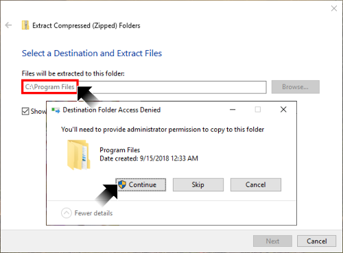(#nolink)

* The critical file `ffmpeg.exe` should now be extracted to the path "`C:\Program Files\ffmpeg-<VERSION>-essentials_build\bin`"
   * **This program can only be used in Command Prompt**, a.k.a. the command line interface (CLI) for Windows

[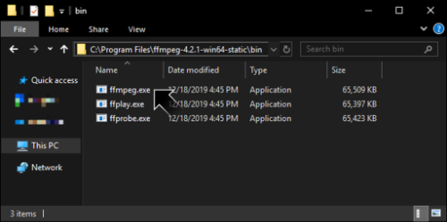](#nolink)

* You must now tell Windows where to find the `ffmpeg.exe` program when using Command Prompt
   * Press the Windows key or click on the Windows button and search for "environment variables"
   * Click on the result "Edit the system environment variables" and System Properties will open
   * Click on the bottom right "Environmental Variables" button

[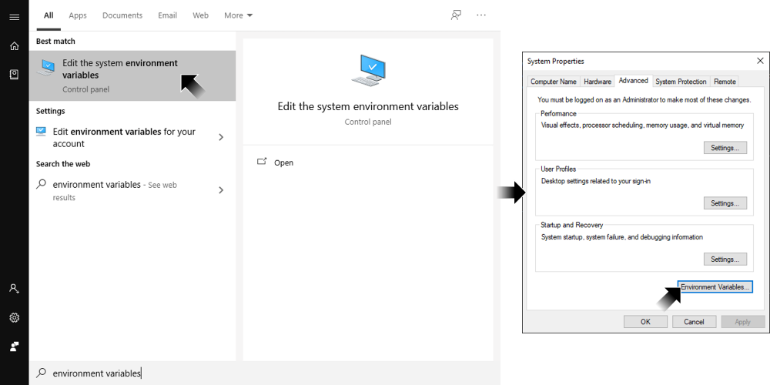](#nolink)

* In the bottom window pane "System variables", click on the variable "**Path**" and click on "Edit"
* Select "New" and new blank text entry will be added at the bottom of the list
* Add the path to that `ffmpeg.exe` file from earlier: "`C:\Program Files\ffmpeg-<VERSION>-essentials_build\bin\`"
* Click on OK to exit all of the windows

[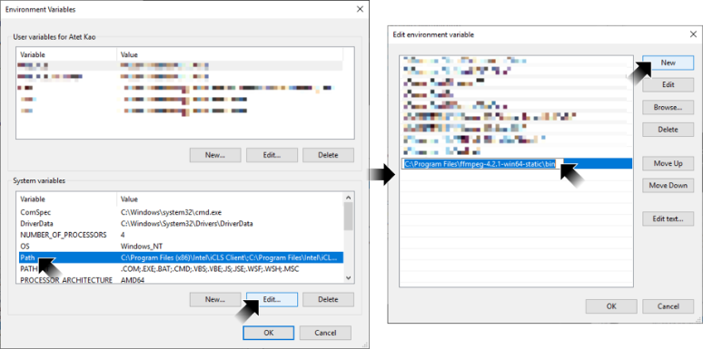](#nolink)

* Let's check that Windows can now access `ffmpeg.exe` in Command Prompt
   * **If you already have Command Prompt open, you must close it and start a new session**
   * Press the Windows key or click on the Windows button and search for "command prompt"
   * Right-click on Command Prompt and "Run as administrator"
   * In the Command Prompt, type `ffmpeg -version` and press Enter
   * You should see information about the `ffmpeg.exe` program such as version, etc.

[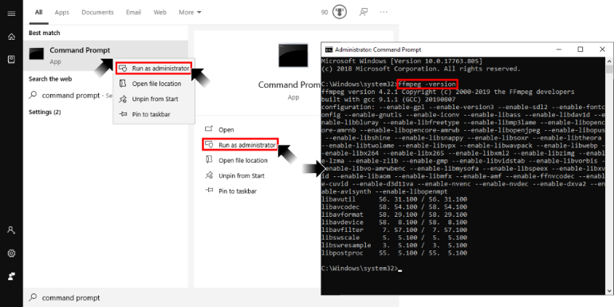](#nolink)

[Back to Top](#table-of-contents)

--------------------------------------------------------------------------------------------------

## 2. Example Files

* We will use a short video file and an audio file in this tutorial
* Make a new folder on your desktop called "Example" and download the following two files there:
   * Video<sup>[[1]](#acknowledgments)</sup>: [Ferris Wheel - 18386.mp4](https://github.com/atet/codec/blob/main/.video/Ferris%20Wheel%20-%2018386.mp4?raw=true)
   * Audio<sup>[[2]](#acknowledgments)</sup>: [Chuzausen_-\_06\_-_Raro_Bueno.mp3](https://github.com/atet/codec/blob/main/.video/Chuzausen_-_06_-_Raro_Bueno.mp3?raw=true)
* **Remember the path to this folder, e.g. `C:\Users\<USERNAME>\Desktop\Example`**

[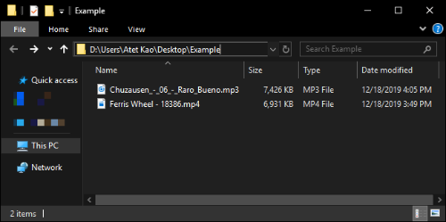](#nolink)

[Back to Top](#table-of-contents)

--------------------------------------------------------------------------------------------------

## 3. Navigation

* Run Command Prompt as Administrator
* Navigate to your Example folder
   * If the folder is in a different drive, you must execute "`<DRIVE LETTER>:`" to switch to that drive first (don't forget that colon)
   * If there are spaces in the filepath, you need to surround the path in quotation marks to change to that folder with the `cd` command

[](#nolink)

[Back to Top](#table-of-contents)

--------------------------------------------------------------------------------------------------

## 4. Your First Transcoding

* If you open the video `Ferris Wheel - 18386.mp4`, you'll notice that there's no audio
* **We are going to combine the video and audio files you downloaded into a single file**
* In the Command Prompt, navigate to the Example folder with the two files and execute the following command:

```
ffmpeg -i "Ferris Wheel - 18386.mp4" -i "Chuzausen_-_06_-_Raro_Bueno.mp3" -c copy -shortest -map 0:v:0 -map 1:a:0 output.mp4
```

[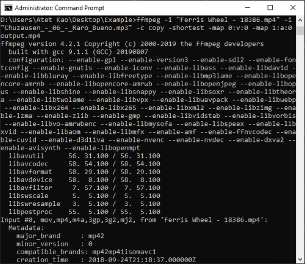](#nolink)

* There will be a lot of text output after running this command, but the processing should take only a second
* Now if you open `output.mp4`, you'll hear that the music is now combined with the video

[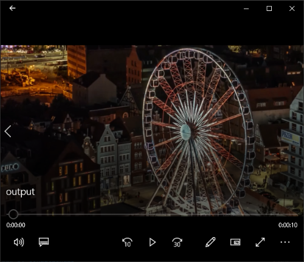](#nolink)

[Back to Top](#table-of-contents)

--------------------------------------------------------------------------------------------------

## 5. Background

* Now that you've experienced how easy it is to use `ffmpeg` in a command line interface (CLI), we will go over some additional information
* **Q: Why are we using `ffmpeg` in CLI when there is...**
   * A: Depending on your use case, it may be vastly more efficient to transcode multiple videos this way versus a graphical user interface (GUI) program
* **Q: What did I just type above?**
   * A: The command you executed is just a chain of instructions you are giving the `ffmpeg` program to perform:
```
ffmpeg -i "Ferris Wheel - 18386.mp4" -i "Chuzausen_-_06_-_Raro_Bueno.mp3" -c copy -shortest -map 0:v:0 -map 1:a:0 output.mp4
```
Command | Description
--- | ---
`ffmpeg` | Calls the program `ffmpeg` to be used
`-i "<FILENAME>"` | Signifies that the following filename(s) in quotation are input(s), note that we are using a video and an audio file as two separate inputs, e.g. `-i "Ferris Wheel - 18386.mp4" -i "Chuzausen_-_06_-_Raro_Bueno.mp3"`
`-c copy` | Copy over the video and audio without re-encoding it to another format
`-shortest` | Have the output file be only as long as the shortest file, note that `Ferris Wheel - 18386.mp4` is the shortest file at 10 seconds
`-map 0:v:0` | From the first file (zero-based, so the first file is file #0), look at the video streams (`:v:`) and use the first video stream #0
`-map 1:a:0` | From the second file (file #1), look at the audio streams (`:a:`) and use the first audio stream #0
`output.mp4` | Name given to the new file that will be created in the current directory

* **Q: Wait a minute, we just copied over the video and audio stream, that wasn't "transcoding"!**
   * A: Good catch! This is a complex topic, it's better to accomplish something useful than drown in background info first (_see the next section for actual transcoding_)

[Back to Top](#table-of-contents)

--------------------------------------------------------------------------------------------------

## 6. Best Practices

This section will cover two major best practices in video transcoding

### **6.1: "Always transcode to a lower quality"**

* Raw video from most cameras and cell phones will already be in a **compressed** format and that video will be **the best quality it will ever be**
   * If you recorded video at 720p, it will not look any better if you transcode it up (a.k.a. upscale) to 1080p in most circumstances
* [Most popular video compression techniques are **"lossy"**](https://en.wikipedia.org/wiki/Lossy_compression), this is exemplified with a picture of Mona Lisa<sup>[[3]](#acknowledgments)</sup> below losing significant detail when resized back to 200x200 pixels:

[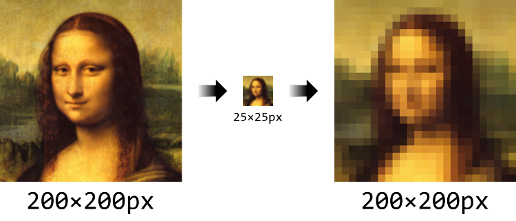](#nolink)

* Let's transcode the `output.mp4` video from its original 1920x1080 resolution down to 160x90:
```
ffmpeg -i "output.mp4" -s 160x90 "output160x90.mp4"
```
* Now let's transcode the resulting `output160x90.mp4` back to 1920x1080 and see what happens:
```
ffmpeg -i "output160x90.mp4" -s 1920x1080 "output1920x1080.mp4"
```
* It looks like **quality definitely took a hit** by upscaling back from a lower resolution:
   * The image does not look as "jagged" as Mona Lisa because `ffmpeg` may smooth out frames during upscaling

[](#nolink)

### **6.2: "There exists an optimal balance of quality and file size"**

* Know that some videos can be _very large files_ and you could waste hours uploading/downloading your files or run out of hard drive space
* Previously, we saw how upscaling from a lower resolution reduced quality, but what wasn't shown was that the file size also **decreased by 44%**:

File Name | Description | File Size | Bit Rate (kbps) | Resolution
--- | --- | --- | --- | ---
`output.mp4` | Original | 6.99 MB | 5,781 | 1920x1080
`output1920x1080.mp4` | "Upscaled" | 3.89 MB | 3,224 | 1920x1080

* Previously, we **drastically** reduced quality to a point of being unacceptable in two separate steps:
   * `output.mp4` → `output160x90.mp4` → `output1920x1080.mp4`
* Let's do this in one step by adjusting **bit rate** and hopefully find a good balance between quality and file size:
```
ffmpeg -y -i "output.mp4" -b:v 2000k -pass 1 -an -f mp4 NUL && ffmpeg -i "output.mp4" -b:v 2000k -pass 2 -c:a copy output2.mp4
```
* Looking at `output2.mp4`:
   * The **file size is 2.84 MB (59% decrease!)** @ ~2,000 kbps bit rate
   * The **video quality is almost indistinguishable** from the original `output.mp4`
   * We got the **best of both worlds** here: Sufficient video quality for our needs and a huge reduction in file size
   * What we just performed is called a **two-pass transcoding to get the average bit rate (ABR)** for video (audio stream was not changed)
* **Explore this topic more with your own videos...**
   * Think about the detail you actually need vs. what is practical
   * Put yourself in the shoes of the end user: Would your experience be negatively affected if you are waiting forever to stream unnecessarily huge content to your phone?
   * Does your end user have the same internet speeds as you?
   * Is a large part of your day waiting for large video files to transfer, upload, backup, etc.?

[Back to Top](#table-of-contents)

--------------------------------------------------------------------------------------------------

## Technical Details

**The following are three important concepts that you should know**

### **1: Containers**

* Video files are just containers of streams (video, audio, subtitles, etc.)
* You may need to package multiple audio or text streams for different language translations of spoken content
* Below to the left is a representation of a generic file while the right describes the `output.mp4` container we made earlier: 

[](#nolink)

* The streams within could be encoded using different codecs, each with their own advantages

### **2: Transcoding Performance**

* The process of transcoding can be CPU intensive, especially if you are processing many large files (e.g. 100+ 4K videos from your vacation)
* **`ffmpeg` should automatically be using the optimal amount of threads for your computer's CPU**
* We will simulate a single-core CPU vs. a quad-core CPU to exemplify this point by transcoding a 4K video to 1080p:

Threads | Processing FPS | Time Elapsed (sec.) | Command
--- | --- | --- | ---
1 | 6 | 184 | `ffmpeg -i "From The Air - 9798.mp4" -s 1920x1080 -threads 1 "test.mp4"`
4 | 8.1 | **137 (25% less time)** | `ffmpeg -i "From The Air - 9798.mp4" -s 1920x1080 -threads 4 "test.mp4"`

* Having 2x cores doesn't necessarily mean a 2x increase in video processing power, _but it will help_, so do your research if this is important to you
* If you want to try this yourself, you can download the video here<sup>[[4]](#acknowledgments)</sup> (this is a big file @ 99 MB!): [From The Air - 9798.mp4](https://github.com/atet/codec/blob/main/.video/From%20The%20Air%20-%209798.mp4?raw=true) 

### **3: Bit Rate**

* Think of video as just a slide show of individual pictures
   * Each picture has a resolution and some level of compression which yields its total file size
   * We did not dive into audio much, but know that you can also reduce an audio stream's bit rate which may reduce file size without reducing _perceived_ quality
* As discussed above in **6.2: "There exists..."**, you may have to play around with finding a sweet spot between video quality and file size
* You can find the bit rate information for a video with the following:
   * `ffmpeg`: Execute the following and look for `bitrate: <BIT RATE> kb/s` in the output (ignore the warning):
      ```
      ffmpeg -i "<FILENAME>"
      ```

[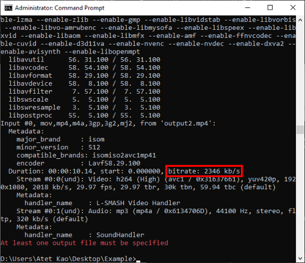](#nolink)

   * Windows: Right-click on the video file, select "Properties", select "Details" tab (these numbers may be slightly different than from `ffmpeg`)

[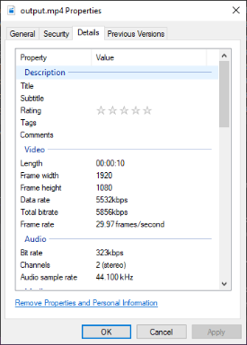](#nolink)

* There are general recommendations for what bit rates specific resolutions and frame rates should have
* The following are Google's recommendations for videos being uploaded to YouTube: https://support.google.com/youtube/answer/1722171?hl=en
   * Container: MP4
   * Aspect Ratio: 16:9
   * Audio Codec: AAC
   * Audio Bit Rate (kbps): 128 (Mono), 384 (Stereo), 512 (5.1 Surround)
   * Video Frame Rate: Same as original (supports 24-60+)
   * Video Codec: H.264
   * Video Bit Rate (VBR):

Pixel Resolution | kbps @ 24-30 FPS | Filesize MB/min @ 24-30 FPS | VBR (kbps) @ 48-60 FPS | Filesize MB/min @ 48-60 FPS
--- | --- | --- | --- | ---
3840x2160 (4K, Ultra-HD) | 45,000 | 338 | 68,000 | 510
2560x1440 (2K, 1440p) | 16,000 | 120 | 24,000 | 180 
1920x1080 (1080p, Full-HD) | 8,000 | 60 | 12,000 | 90
1280x720 (720p, HD) | 5,000 | 38 | 7,500 | 56
854x480 (FWVGA) | 2,500 | 19 | 4,000 | 30
640x360 (VGA) | 1,000 | 8 | 1,500 | 11

> A 4K @ 60 FPS video encoded at 68,000 kbps will be around 510 MB per minute of video, so about 30 hours would fill up a 1 TB hard drive

[Back to Top](#table-of-contents)

--------------------------------------------------------------------------------------------------

## Troubleshooting

* If you've never navigated Windows through Command Prompt, there may be some things you missed:

Command Prompt Error | Solution
--- | ---
`'ffmpeg' is not recognized as...` | Directory where `ffmpeg.exe` is located was not added correctly to Window's Environment Variables, go back to step [1. Installation](#1-installation) and/or close Command Prompt and reopen it
`<FILENAME>: No such file or directory` | Filename wrong, filename with spaces was not surrounded by quotation marks, and/or you are not currently in the directory where the file is located

* Other issues:

Issue | Solution
--- | ---
Windows 10's "Movies & TV" player won't play my video file | Windows 10 comes with select codecs and you may need to install others or use a different player (e.g. VLC media player), your video may be corrupted, and/or incompatible settings used during `ffmpeg` processing

[Back to Top](#table-of-contents)

--------------------------------------------------------------------------------------------------

## Other Resources

* `ffmpeg` is a powerful tool because it has a lot of functionality and can be quite complex
* These are some resources that provide more detail than what I have here:

Description | Link
--- | ---
Official `ffmpeg` manual | <a href="https://ffmpeg.org/ffmpeg.html" target="_blank">https://ffmpeg.org/ffmpeg.html</a>
Google Developers From Raw Video to Web Ready | <a href="https://developers.google.com/web/fundamentals/media/manipulating/files" target="_blank">https://developers.google.com/web/fundamentals/media/manipulating/files</a>
Google Developers Media Manipulation Cheat Sheet | <a href="https://developers.google.com/web/fundamentals/media/manipulating/cheatsheet" target="_blank">https://developers.google.com/web/fundamentals/media/manipulating/cheatsheet</a>
`ffmpeg` Two-Pass Transcoding | <a href="http://trac.ffmpeg.org/wiki/Encode/H.264#twopass" target="_blank">http://trac.ffmpeg.org/wiki/Encode/H.264#twopass</a>
YouTube's Recommended Video Encoding Settings | <a href="https://support.google.com/youtube/answer/1722171?hl=en" target="_blank">https://support.google.com/youtube/answer/1722171?hl=en</a>
YouTube's Recommended Settings for Live Streaming | <a href="https://support.google.com/youtube/answer/2853702?hl=en" target="_blank">https://support.google.com/youtube/answer/2853702?hl=en</a>

[Back to Top](#table-of-contents)

--------------------------------------------------------------------------------------------------

## Glossary

Term | Definition
--- | ---
Bit Rate | An amount of data (video, audio, etc.) per unit time, e.g. kilobits per second (kbps or kb/s)
Codec | A program that compresses data to enable faster transmission and decompresses received data
Container | A file that may hold multiple data streams (e.g. one video stream and two audio streams of different languages)
Data Stream | In the context of this tutorial, distinct data that is video or audio
Encoding | The _original_ compression of data (used interchangeably with transcoding)
File Format | Containers will have a file format, e.g. `*.mp4`, `*.webm`
Transcoding | The process of decoding → reformatting → re-encoding a file (used interchangeably with encoding)

[Back to Top](#table-of-contents)

--------------------------------------------------------------------------------------------------

## Acknowledgments

1. Video: [Ferris Wheel - 18386.mp4](https://pixabay.com/videos/download/video-18386_large.mp4?attachment)
   * Attribution: [Nature-Stock-Footage (Pixabay)](https://pixabay.com/users/nature-stock-footage-10096666/)
   * License: [Pixabay License](https://pixabay.com/service/license/): Free for commercial use, no attribution required
   * File Size: 6.76 MB
   * Dimensions: 1920x1080
2. Audio: [Chuzausen_-\_06\_-_Raro_Bueno.mp3](https://files.freemusicarchive.org/storage-freemusicarchive-org/music/Enough_Records/Chuzausen/Awesome_Is_Grey/Chuzausen_-_06_-_Raro_Bueno.mp3)
   * Attribution: [Chuzausen (Free Music Archive)](https://www.freemusicarchive.org/music/Chuzausen)
   * License: [Attribution-NonCommercial-ShareAlike 3.0 International License](https://creativecommons.org/licenses/by-nc-sa/3.0/)
   * File Size: 7.25 MB
3. Mona Lisa from: [https://commons.wikimedia.org/wiki/File:Mona_Lisa_headcrop.jpg](https://commons.wikimedia.org/wiki/File:Mona_Lisa_headcrop.jpg)
4. Video: [From The Air - 9798.mp4](https://pixabay.com/videos/download/video-9798_large.mp4?attachment)
   * Attribution: [lukasbieri (Pixabay)](https://pixabay.com/users/lukasbieri-4664461/)
   * License: [Pixabay License](https://pixabay.com/service/license/): Free for commercial use, no attribution required
   * File Size: 114 MB (Original), edited in this repos to 99 MB (GitHub file size limit)
   * Dimensions: 4096x2160

<a href="" target="_blank"></a>

[Back to Top](#table-of-contents)

--------------------------------------------------------------------------------------------------

<p align="center">Copyright © 2019-∞ Athit Kao, <a href="http://www.athitkao.com/tos.html" target="_blank">Terms and Conditions</a></p>